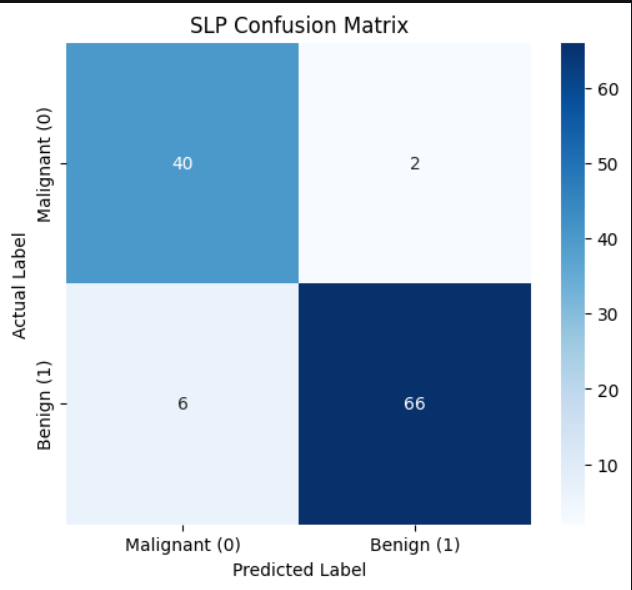
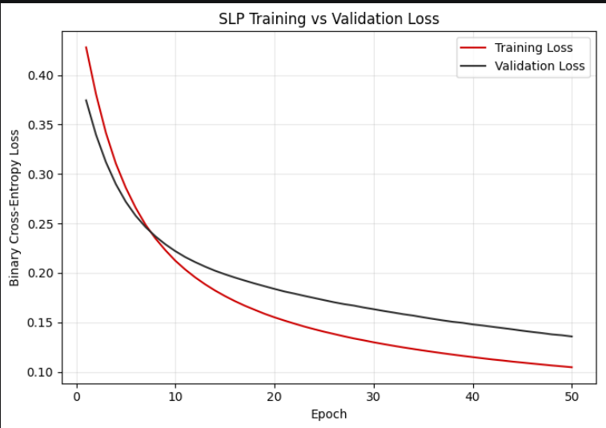
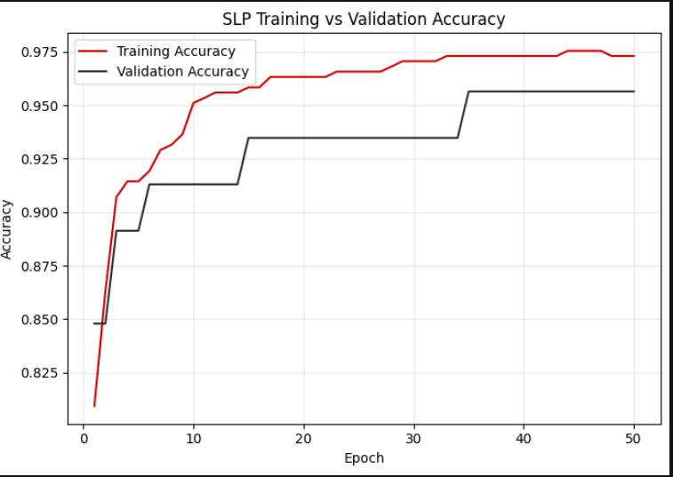

# 🧠 Deep Learning PR-1 — Breast Cancer Classification

<div align="center">

### 🧬 Breast Cancer Classification using Neural Networks

**SLP • MLP • Activation Functions • Early Stopping • Dropout • Regularization**


</div>

---

## 📌 About The Project

This project implements and compares different **Deep Learning techniques** for binary classification using the **Breast Cancer Wisconsin (Diagnostic) Dataset**.

The project starts with a simple **Single-Layer Perceptron (SLP)** and gradually improves the model using **MLP, activation functions, Early Stopping, Dropout, L1, L2 and L1-L2 regularization**.

### Main Topics

* Data Loading & EDA
* Feature Scaling
* SLP
* MLP
* ReLU / Tanh / Sigmoid
* Early Stopping
* Dropout
* L1 Regularization
* L2 Regularization
* L1-L2 / ElasticNet
* Model Comparison
* Clinical Insight

---

## 📊 Dataset

**Breast Cancer Wisconsin (Diagnostic) Dataset**

| Property       | Value                 |
| -------------- | --------------------- |
| Samples        | 569                   |
| Features       | 30                    |
| Malignant      | 212                   |
| Benign         | 357                   |
| Target         | Binary Classification |
| Target 0       | Malignant             |
| Target 1       | Benign                |
| Missing Values | None                  |

### Dataset Loading

```python
from sklearn.datasets import load_breast_cancer

data = load_breast_cancer(as_frame=True)

X = data.data
y = data.target
```

## Streamlit link

- []

---

# 🔄 Project Workflow

```text
Dataset
   ↓
EDA
   ↓
Train/Test Split
   ↓
StandardScaler
   ↓
SLP
   ↓
MLP
   ↓
Activation Comparison
   ↓
Early Stopping
   ↓
Dropout
   ↓
L1 / L2 / L1-L2
   ↓
Final Combined Model
   ↓
Model Comparison
```

---

# 🔍 EDA

### Target Class Distribution

The dataset contains **212 malignant** and **357 benign** samples, showing a mild class imbalance.

### Feature Correlation

Important highly correlated features include:

* `radius_mean`
* `perimeter_mean`
* `area_mean`

---

# ⚙️ Data Preprocessing

### Train/Test Split

```python
from sklearn.model_selection import train_test_split

X_train, X_test, y_train, y_test = train_test_split(
    X,
    y,
    test_size=0.2,
    random_state=42,
    stratify=y
)
```

### Standard Scaling

```python
from sklearn.preprocessing import StandardScaler

scaler = StandardScaler()

X_train_sc = scaler.fit_transform(X_train)
X_test_sc = scaler.transform(X_test)
```

The scaler is fitted only on the training data to avoid **data leakage**.

---

# 🧠 Model 1 — SLP

### Architecture

```text
30 Features
     ↓
Dense(1, Sigmoid)
```

**Parameters:** 31

```python
model_slp = keras.Sequential([
    keras.layers.Dense(
        1,
        activation='sigmoid',
        input_shape=(30,)
    )
])
```

### Configuration

| Parameter  | Value               |
| ---------- | ------------------- |
| Optimizer  | Adam                |
| Loss       | Binary Crossentropy |
| Epochs     | 50                  |
| Batch Size | 32                  |

---

# 🧠 Model 2 — MLP

### Architecture

```text
30
 ↓
Dense(64, ReLU)
 ↓
Dense(32, ReLU)
 ↓
Dense(1, Sigmoid)
```

```python
model_mlp = keras.Sequential([
    keras.layers.Dense(64, activation='relu', input_shape=(30,)),
    keras.layers.Dense(32, activation='relu'),
    keras.layers.Dense(1, activation='sigmoid')
])
```

---

# ⚡ Activation Function Comparison

Three hidden-layer activation functions were compared:

| Activation | Main Property          |
| ---------- | ---------------------- |
| ReLU       | Fast convergence       |
| Tanh       | Zero-centred output    |
| Sigmoid    | Output between 0 and 1 |

---

# ⏹️ Early Stopping

```python
from tensorflow.keras.callbacks import EarlyStopping

es = EarlyStopping(
    monitor='val_loss',
    patience=15,
    restore_best_weights=True,
    verbose=1
)
```

Early Stopping monitors validation loss and stops training when the model stops improving.


# 💧 Dropout

### Architecture

```text
Dense(128, ReLU)
 ↓
Dropout(0.3)
 ↓
Dense(64, ReLU)
 ↓
Dropout(0.3)
 ↓
Dense(1, Sigmoid)
```

Dropout reduces overfitting by randomly deactivating neurons during training.

---

# 🧮 Regularization

Three regularization methods were evaluated:

| Method    | Purpose                            |
| --------- | ---------------------------------- |
| **L1**    | Sparse weights / feature selection |
| **L2**    | Weight shrinkage and stability     |
| **L1-L2** | Combination of L1 + L2             |

# 📈 Visualizations

## Exploratory Data Analysis

- HeatMap
- Plot Chart

## Heatmap 

- 

## Plot Chart

- 

- 

---

# 🏆 Final Model

The final model combines:

**L2 + Dropout + Early Stopping**

```text
Dense(128, ReLU, L2)
        ↓
Dropout(0.3)
        ↓
Dense(64, ReLU, L2)
        ↓
Dropout(0.3)
        ↓
Dense(1, Sigmoid)
```

This combination is designed to improve generalisation and reduce overfitting.

---

# 📋 Results Comparison

| Model                | Regularization | Dropout | Early Stopping | Accuracy | Precision | Recall | F1 |
| -------------------- | -------------- | ------: | -------------- | -------: | --------: | -----: | -: |
| SLP                  | None           |     0.0 | No             |        — |         — |      — |  — |
| MLP-ReLU             | None           |     0.0 | No             |        — |         — |      — |  — |
| MLP + Early Stopping | None           |     0.0 | Yes            |        — |         — |      — |  — |
| MLP + Dropout        | None           |     0.3 | Yes            |        — |         — |      — |  — |
| MLP + L2             | L2             |     0.0 | Yes            |        — |         — |      — |  — |
| Final Combined       | L2             |     0.3 | Yes            |        — |         — |      — |  — |

> Replace `—` with the actual values from the notebook results.

---

# 🏥 Clinical Insight

For cancer classification, **Recall is particularly important** because a false negative can mean a malignant case is incorrectly classified as benign.

Therefore, model selection should consider:

**Recall + Precision + F1-Score + Test Accuracy**

A lower classification threshold than the default `0.5` may also be investigated if it improves recall and reduces false negatives.

> This project is for educational purposes and is not a medical diagnostic system.

---

# 🛠️ Technologies Used

| Technology       | Usage                   |
| ---------------- | ----------------------- |
| Python           | Programming             |
| TensorFlow       | Deep Learning           |
| Keras            | Neural Networks         |
| Scikit-Learn     | Dataset & Preprocessing |
| Pandas           | Data Handling           |
| NumPy            | Numerical Operations    |
| Matplotlib       | Visualization           |
| Seaborn          | Visualization           |
| Jupyter Notebook | Development             |

---

# 📁 Project Files

```text
Deep-Learning-PR-1/
│
├── DL_PR1.ipynb
├── DL_PR1.html
├── README.md
├── requirements.txt
│
└── plots/
    ├── 01_target_class_distribution.png
    ├── 02_feature_correlation_heatmap.png
    ├── 03_slp_training_curves.png
    ├── 04_slp_confusion_matrix.png
    ├── 05_activation_comparison.png
    ├── 07_early_stopping_curve.png
    ├── 08_early_stopping_comparison.png
    ├── 09_dropout_comparison.png
    ├── 11_regularization_comparison.png
    ├── 12_regularization_accuracy.png
    └── 13_final_confusion_matrix.png
```

---

# 👩‍💻 Author

**Janki Dholariya**

**Breast Cancer Classification using Neural Networks**

---